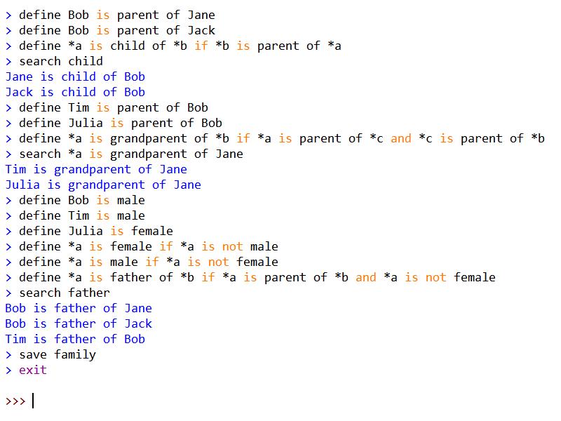

# Inference

一个能根据给定事实和规则进行推论的人工智障



---

## 基础语法

* 一个语句中单词与单词用空格隔开。语句中允许使用括号。

* 所有以 * 开头的单词会被视为**变量**（Variable），可以匹配任何字面值或是其他变量。

* 所有处于```is```右侧与```is of```中间的单词会被视为**关系**（Assoc）。

* 所有不以 * 开头且不属于关系或是关键字的单词为**字面值**（Literal）。

* **关键字**（Keyword）是拥有特殊语法规则的单词，它们不能被用作字面值。

<details>
<summary>现版本程序内保留的关键字如下：</summary>
  &nbsp;&nbsp;&nbsp;&nbsp;●&nbsp;&nbsp;define<br/>
  &nbsp;&nbsp;&nbsp;&nbsp;●&nbsp;&nbsp;search<br/>
  &nbsp;&nbsp;&nbsp;&nbsp;●&nbsp;&nbsp;save<br/>
  &nbsp;&nbsp;&nbsp;&nbsp;●&nbsp;&nbsp;load<br/>
  &nbsp;&nbsp;&nbsp;&nbsp;●&nbsp;&nbsp;quit<br/>
  &nbsp;&nbsp;&nbsp;&nbsp;●&nbsp;&nbsp;exit<br/>
  &nbsp;&nbsp;&nbsp;&nbsp;●&nbsp;&nbsp;if<br/>
  &nbsp;&nbsp;&nbsp;&nbsp;●&nbsp;&nbsp;and<br/>
  &nbsp;&nbsp;&nbsp;&nbsp;●&nbsp;&nbsp;or<br/>
  &nbsp;&nbsp;&nbsp;&nbsp;●&nbsp;&nbsp;not<br/>
</details>


---

## 表达式

* **```is```**：用于表示从属，否定形式为```is not```，格式如下：
  ```
  (Variable | Literal) is [not] Assoc
  ```
  * **示例**：
    
    ```
    Bob is male
    python is not bird
    ```
  
* **```is of```**：用于表示相关，否定形式为```is not of```，格式如下：
  ```
  (Variable | Literal) is [not] Assoc of (Variable | Literal)
  ```
  * **示例**：
    
    ```
    *a is parent of *b
    Camus is not author of Ulysses
    ```
  
* **```equals```**：用于表示相等，否定形式为```not equals```，格式如下：
  ```
  (Variable | Literal) [not] equals (Variable | Literal)
  ```
  * **示例**：
    
    ```
    *a equals Jack
    bike not equals bicycle
    ```

**注意**：现版本仅支持在表达**逻辑关系**时使用否定形式，在define语句的推论部分和search语句中使用否定形式**不会获得预期结果**。

* **错误示例**：
  
  ```
  define Bob is not female
  search *a is not father of *b
  ```

---

## 语句

* **```define```**：用于定义事实和规则，格式如下：
  ```
  define HEAD [if BODY]
  ```

  完整的```define```语句用于定义规则，其中BODY为**条件**部分，HEAD为**推论**部分，当条件满足时推论成立。省略```if```和BODY部分的```define```语句用于定义事实。
  
  ```define```语句中的BODY部分可以为任意合法的逻辑表达式（可包含```and or not```以及括号），HEAD部分**只能**使用```is```和```is of```语法。

  * **示例**：
    
    ```
    define *a is sibling of *b if *a not equals *b and (*c is parent of *a and *c is parent of *b)
    ```
  
**注意**：定义规则时可以嵌套或递归。但为了防止无限循环，现版本在递归到重复的关系时会**强行中止**递归的进行导致结果**可能**不符合预期。
  
* **```search```**：用于查找符合的匹配，格式如下：
  ```
  search (HEAD | Assoc)
  ```

  其中HEAD部分要求与```define```中一致。当```is```左侧或```is of```左右两侧都为变量时，```is```和```is of```表达式可简写为**仅关系名一个单词**。也就是说，当你定义了以下两个关系：
  ```
  define Bob is male
  define Bob is parent of Jane
  ```

  此时，下面的每一对语句都是**等价**的：
  ```
  search *a is male
  search male

  search *a is parent of *b
  search parent
  ```

* **```save```**：用于保存你定义的事实与规则，格式如下：
  ```
  save File
  ```

  ```save```会在文件夹**save**中创建一个名为File的存档，原汁原味（说不定修得漂亮了些）保存了你在终端中的所有导入和定义，你可以打开并修改它。

* **```load```**：导入你保存的存档，格式如下：
  ```
  load File
  ```
  
```load```在文件夹**save**中寻找并导入存档，它不会因为两个存档间的互相导入爆炸。
  
* **```quit & exit```**：退出终端，格式如下：
  ```
  quit | exit
  ```
  
  使用Python直接打开的终端会直接关闭，在Python Shell中打开的终端会回到Python Shell的交互界面，再次调用```main()```进入的终端**不会保留**上一个终端的导入与定义记录。

---

## 冷知识

其实几乎所有输入的表达式和语句最后都会被解析为Lisp表达式（```quit```和```exit```会直接被特判），而在终端中直接输入对应的Lisp表达式也是合法的。只不过用这种方式定义的Assoc被```search```打印出来时可能没那么好看。

所以，如果你能够忍受那一大堆括号的话，可以尝试以Lisp语法输入。下面每一对语句都是**等价**的：
```
define Bob is parent of Jane
(define (parent Bob Jane))

define Bob is male
(define (male Bob))

define *a is sibling of *b if *a not equals *b and (*c is parent of *a and *c is parent of *b)
(define (if (sibling *a *b) (and (not (= *a *b)) (and (parent *c *a) (parent *c *b)))))

search parent
(search (parent *a *b))

save family
(save family)

load family
(load family)
```

**注意**：如果你真的想这么干，记住本程序的```and```和```or```只能接受两个参数而不是像真正Lisp的```and```和```or```一样能接受任意数量的参数。